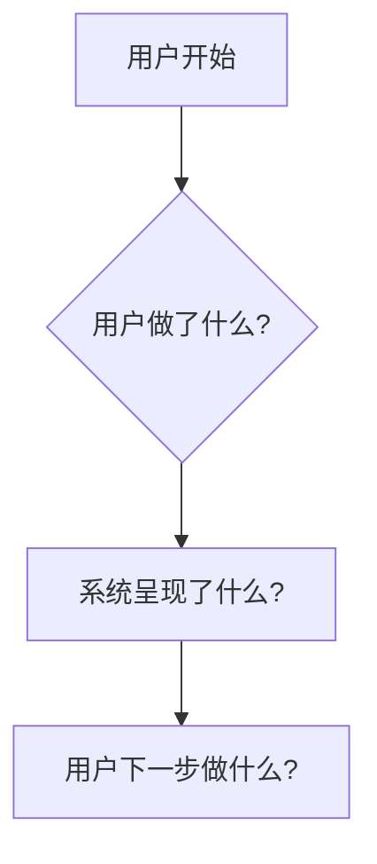

# 概要设计文档 (High-Level Design): [功能标题]

**关联研究**: `research.md`
**创建日期**: [YYYY-MM-DD]
**状态**: [草案 / 已批准]

---

## 1. 设计目标与哲学 (Design Goals & Philosophy)
*本设计的核心目标与指导思想。*

- **目标**: [AI 将从 `research.md` 中提炼出本功能要解决的核心问题]。
- **哲学**:
    - **简洁至上 (Simplicity First)**: 只设计满足核心目标的必要元素。我们只设计和构建当前绝对需要的功能。
    - **事实驱动 (Fact-Driven)**: 所有设计都必须直接源自 `research.md` 中已澄清的业务意图和代码脉络。
    - **价值论证 (Value Justification)**: 每一个设计元素的存在，应该通过一个清晰的场景来证明其不可或缺的价值。

---

## 2. 核心用户交互流程 (Core User Interaction Flow)
*从用户的视角，描述他们将如何与这个功能进行交互的最简路径。*

**流程解读**: [对上述用户旅程的简要文字说明]。

---

## 3. 关键设计元素与价值论证 (Key Design Elements & Value Justification)
*定义实现核心目标所需的最少“做什么”(What)的元素。每一项的存在都有清晰的价值支撑。*

### **设计元素 1: [例如: 字段 `sampleValues` ]**
- **设计**: 在扫描结果中增加一个 `String[]` 类型的字段，用于存储样本值。
- **价值论证 (Why is this essential?)**:
  > **场景**: “作为一名**问题排查人员**，当我看到一条扫描记录时，我需要能**立即看到几个具体的样本值**，以便快速判断问题的性质。”
- **结论**: 若无此字段，上述核心场景无法实现，因此该设计是必要的。

*(... AI 将在此处添加其他“做什么”的元素, 并为每一个提供价值论证 ...)*

---

## 4. **【新增】对技术实现的约束 (Constraints for Technical Implementation)**
*本节定义了源于产品和用户体验需求、但会直接影响技术选型和架构的关键约束。这**不是**技术设计，而是技术设计的**边界条件**。*

- **约束一 (例如: 实时性要求)**: [描述: 用户完成操作后，界面必须在 500ms 内无刷新更新。 理由: 保障流畅的用户体验。]
- **约束二 (例如: 数据一致性要求)**: [描述: 交易操作必须保证强一致性。 理由: 涉及金融计算，不允许数据不一致。]
- **约束三 (例如: 安全要求)**: [描述: 用户密码必须经过加盐哈希处理，且盐值唯一。 理由: 遵循行业安全标准。]

---

## 5. 明确的范围边界 (Deliberately Out of Scope)
*为防止范围蔓延和过度设计，我们在此明确声明本次 **不包含** 的内容。这些都是被主动舍弃的复杂性。*

- **舍弃**: [例如: 对 `sampleValues` 进行搜索或过滤的功能。]
    - **理由**: 当前核心场景是“查看”，而非“分析”。