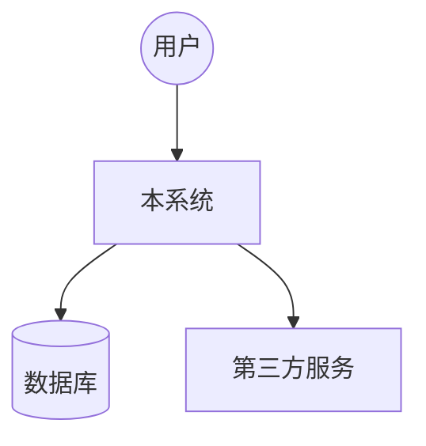
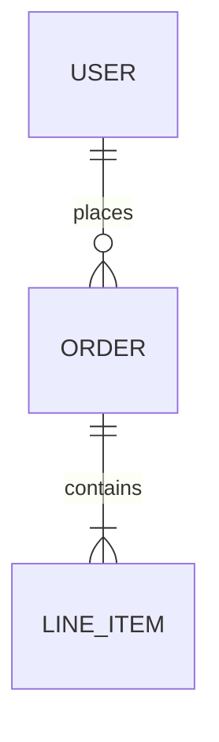
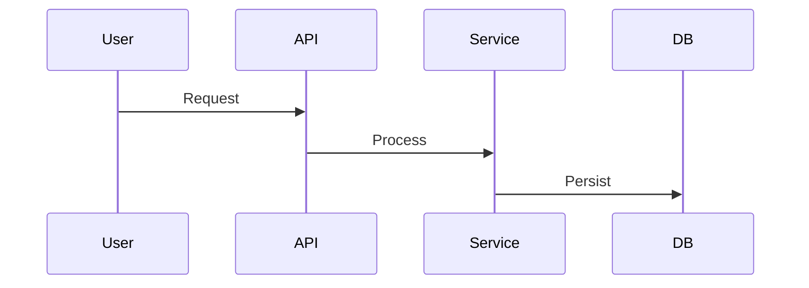

# [项目名称] 系统概览与技术白皮书

> **文档元数据**
> - **文档版本**: [例如: v2.3.0]
> - **最后更新**: [YYYY-MM-DD]
> - **更新来源**: [例如: Feature 'UserLogin' /research]

---

## 1. 系统全景 (System Landscape)

### 1.1 核心价值主张
*简述本系统解决的核心问题及目标用户。*

### 1.2 高层架构图 (C4 Level 1 - System Context)
*使用 Mermaid 展示系统与外部系统、用户的交互关系。*



### 1.3 技术栈清单
| 领域 | 技术选型 | 版本 | 决策理由 |
| :--- | :--- | :--- | :--- |
| **后端** | [例如: Java/Spring Boot] | [Ver] | [理由] |
| **前端** | [例如: React/Next.js] | [Ver] | [理由] |
| **数据** | [例如: PostgreSQL] | [Ver] | [理由] |
| **Infra**| [例如: Docker/K8s] | [Ver] | [理由] |

---

## 2. 领域与数据模型 (Domain & Data)

### 2.1 实体关系图 (ER Diagram)
*展示业务实体及其关系。进行业务关系描述。应该按照梳理后的业务模块划分部分。*




### 2.2 核心领域概念
*对关键业务对象进行简要定义。*
- **[概念 A]**: [定义]
- **[概念 B]**: [定义]

---

## 3. 关键业务流程 (Core Business Flows)

*记录系统中最重要的、跨组件的业务链路。*

### 3.1 [流程名称，如：订单创建]
*简述流程触发条件和预期结果。*



### 3.2 [流程名称]
...

---

## 4. 工程结构解析 (Codebase Structure)

*通过目录树解释代码组织方式，帮助 AI 快速定位。*

```text
/
├── src/
│   ├── api/            # 接口层：处理 HTTP 请求
│   ├── core/           # 核心域：纯业务逻辑，不依赖框架
│   ├── infrastructure/ # 基础设施：数据库实现、外部适配器
│   └── ...
├── tests/              # 测试套件
└── ...
```

---

## 5. 项目术语表 (Glossary)

*统一项目中的特有名词、缩写和别名。*

| 术语 (Term) | 全称 (Full Name) | 描述 (Description) | 备注 |
| :--- | :--- | :--- | :--- |
| **SDI** | Scan Data Index | 扫描数据索引表，核心存储。 | 别名: scan_table |
| **...** | ... | ... | ... |

---

## 6. 开发与部署指南 (DevOps)

- **本地启动**: `[启动命令]`
- **构建命令**: `[构建命令]`
- **测试命令**: `[测试命令]`
- **配置位置**: `[配置文件路径]`